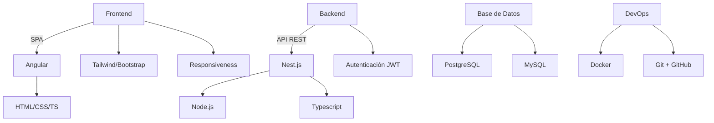

<h1 align="center">Hola, soy Sergio</h1>

  <i>Ingeniero de Sistemas | Desarrollador Web Fullstack</i> 
  Me dedico a construir aplicaciones web de principio a fin, buscando siempre que el código sea mantenible y la experiencia del usuario sea fluida.

---

### Sobre mí

Soy Ingeniero de Sistemas con experiencia práctica en el desarrollo de software. Mi enfoque de trabajo se basa en entender el problema a fondo antes de escribir la primera línea de código. Estoy acostumbrado a trabajar bajo metodologías ágiles, colaborando estrechamente con el equipo para llevar los proyectos a producción de manera segura y estructurada.

- Desarrollo de backend enfocado en estabilidad y rendimiento utilizando **Nest.js** y **Node.js**.
- Construcción de interfaces dinámicas y responsivas con **Angular**, **Tailwind CSS** y **Bootstrap**.
- Implementación de buenas prácticas, desde arquitectura limpia hasta la creación de contenedores con **Docker** e integración continua.

---

### Tecnologías y Herramientas

  

---

### Mi Stack

---

### Mis Contribuciones

  
   
  

---

### Contacto

  
  
  

